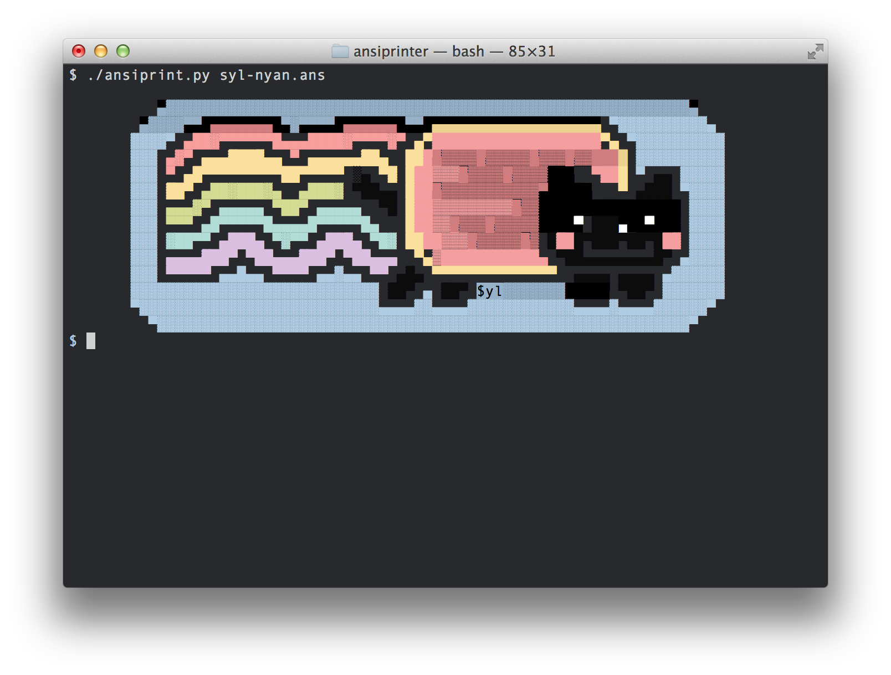

## ANSI printer

(Font: Andale Mono 13pt)


Are you writing a CLI tool in python, but looking to give it that l33t BBS feel?
Rub some ANSI art on it--it's actually really easy:

```
#!/usr/bin/env python2.7
from __future__ import print_function

import io
import os
import sys

def showart(filename):
    with io.open(filename, encoding='cp437', errors='ignore') as source:
        for line in source:
            print(line, end='')

showart(sys.argv[1])
```
